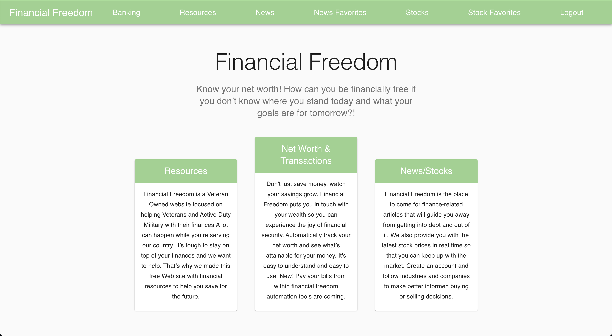
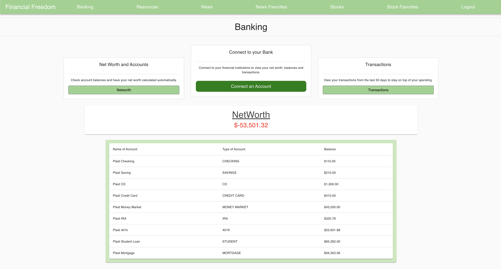
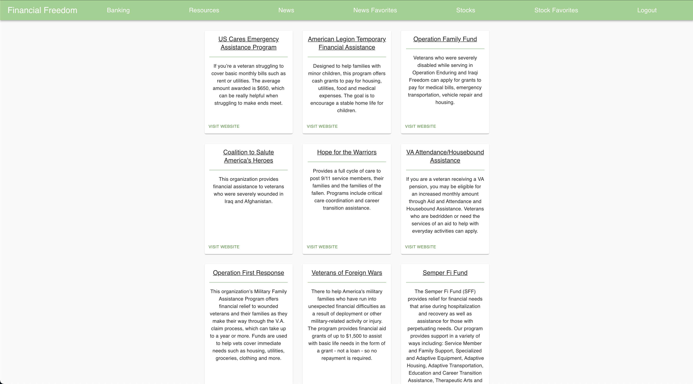
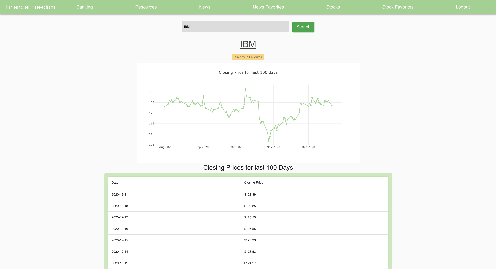
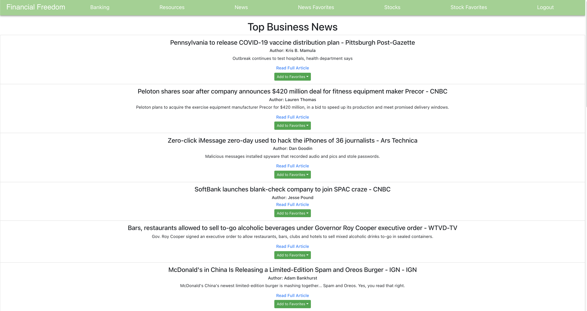

# Financial Freedom

 

  

  <h3 align="center">Financial Freedom</h3>

  

    A financial hub for military service members with resources to help them during hard times.
 

## About The Project
Authenticated website for users to keep track of their net worth, account balances, transactions, stocks, business news, and resources available to them in order to reach financial freedom!

## Built With

* [React](https://reactjs.org/) - Used for front end with Javacript
* [Django](https://www.djangoproject.com/) - Used for back end with Python
* [PostgreSQL](https://www.postgresql.org/) - Used for database and connected to Django
* [Material UI](https://material-ui.com/) - Used for styling
* [Plaid API](https://plaid.com/products/auth/overview/?utm_source=google&utm_medium=search&utm_campaign=Search_G_Brand_Exact&utm_content=plaidapi&utm_term=plaid%20api&utm_creative=481138286063&gclid=CjwKCAiArIH_BRB2EiwALfbH1BJCDkYsFsXWmd-_Yq5HgfAjoKAaB3qgz77hrehqSKKZXnLbrYxW4hoC9l8QAvD_BwE) - Used for connecting to your financial institution
* [Alpha Vantage API](https://www.alphavantage.co/) - Used for getting stock information
* [News API](https://newsapi.org/) - Used for getting the latest business articles

## Features

Connect to your financial institution and get access to your net worth, account balances, and transactions in the last thirty days.

Resources available to help service members during financial hardship.

Look up a stock with its ticker and get a graph and table with the last 100 days of it's closing price. Add it to your favorites to reference later.

Access to the latest bussiness articles and the ability to add them to your customized favorites lists.

## Contact

LinkedIn - https://www.linkedin.com/in/rodriguez-michael/

Email - contact@michaelrodriguez.dev

Personal Site - https://michaelrodriguez.dev/

Project Link: https://github.com/rodriguez-michael/financial-website